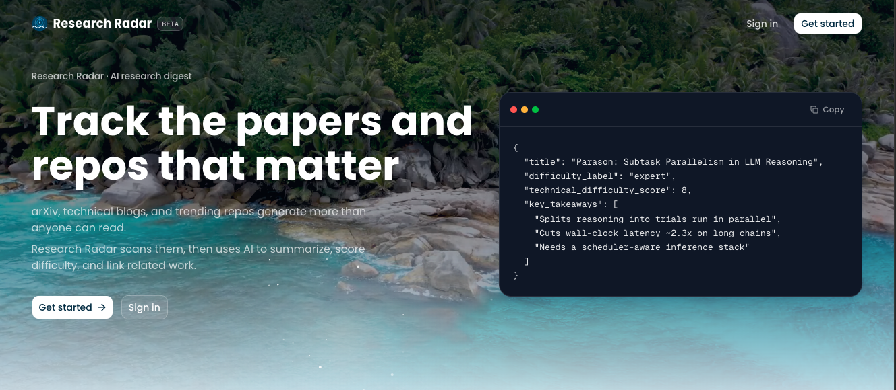

<div align="center">
  <br />
    
  <br />

  <div>


<br />


<br />


  </div>

  <h3 align="center">Research Radar | AI-Powered Research Digest</h3>
</div>

## Table of Contents

1. [Introduction](#introduction)
2. [Tech Stack](#tech-stack)
3. [Features](#features)
4. [Quick Start](#quick-start)

## <a name="introduction">Introduction</a>

Research Radar is a full-stack AI research digest that scrapes real papers and technical blog posts from multiple sources, analyzes each one for technical difficulty and key takeaways, and surfaces a reader-friendly breakdown before you ever open the source. Every card shows an AI-estimated difficulty score; every details page shows the full analysis, and a pgvector-powered Related Research section connects work by meaning instead of shared keywords, so the whole feed refreshes itself every hour with nobody at the keyboard.

Research Radar is also built with an `AGENTS.md` file that defines the project's rules, architecture, and data model once, so the AI coding agent reads it before every feature, drafts its own implementation prompt, and only writes code after approval. Every route, page, and pipeline in this repo was shipped through that same prompt, approve, build loop.

## <a name="tech-stack">Tech Stack</a>

- **[Next.js](https://nextjs.org/)** is a production-ready React framework offering server-side rendering, the App Router, and API routes. It powers Research Radar's full stack, from the authenticated UI to the scraping and analysis API endpoints.

- **[TypeScript](https://www.typescriptlang.org/)** is a strongly typed superset of JavaScript that adds static type definitions across the codebase, keeping the data model, Supabase queries, and AI-validated analysis output type-safe end to end.

- **[Tailwind CSS](https://tailwindcss.com/)** is a utility-first CSS framework used to build Research Radar's responsive design system, from research cards to the difficulty breakdown UI, directly in markup.

- **[Supabase](https://supabase.com/)** is the Postgres-based backend that acts as Research Radar's single source of truth. It stores sources, papers, AI analyses, and scraping logs, and its **pgvector** extension powers the semantic Related Research search.

- **[Clerk](https://clerk.com/)** is a complete authentication and user-management platform. It provides sign-in, sign-up, middleware, and protected routes, so identity is fully handled without hand-rolled auth screens or session logic.

- **[Oxylabs](https://oxylabs.io/)** is a web data platform whose Web Scraper API gives uninterrupted access to arXiv and technical blog listing pages, and whose Scheduler runs those fetches on a recurring basis, powering the hourly scrape.

- **[Vercel AI SDK](https://sdk.vercel.ai/)** is used with **Google Gemini** to run structured paper analysis — neutral summary, technical difficulty score, difficulty label, core methodology, and key takeaways — validated with Zod before it's ever saved.

- **[Google Gemini](https://ai.google.dev/)** powers both the paper analysis calls and the `text-embedding-3-small`-style embeddings that pgvector uses to find related papers by meaning.

- **[Vercel Cron](https://vercel.com/docs/cron-jobs)** triggers Research Radar's pipeline route on a schedule, processing completed Oxylabs scrapes and running AI analysis automatically, hour after hour, once deployed.

## <a name="features">Features</a>

**Real Scraped Research Feed**: A home page of real papers and blog posts pulled from configured sources, with a difficulty metric shown right on every card.

**AI Difficulty & Takeaway Analysis**: Each paper is scored for technical difficulty (1-10), given a difficulty label (beginner / intermediate / expert), and summarized into exactly three developer-focused key takeaways — clearly disclosed as an AI estimate, not objective truth.

**Paper Details Page**: Full view with the AI-generated summary, technical difficulty score, difficulty badge, core methodology breakdown, key takeaways, and confidence score.

**Related Research by Meaning**: A pgvector-powered semantic search that surfaces similar papers by what they're actually about, not by shared keywords or source.

**Authentication**: Clerk-powered sign-in and sign-up, middleware-protected routes, and redirect handling, with the home feed staying public.

**Fully Automated Pipeline**: Oxylabs Scheduler scrapes active sources hourly, and Vercel Cron processes and analyzes the results 15 minutes later — fresh, difficulty-scored research with no manual trigger.

And many more, including code architecture and reusability.

## <a name="quick-start">Quick Start</a>

Follow these steps to set up the project locally on your machine.

**Prerequisites**

Make sure you have the following installed on your machine:

- [Git](https://git-scm.com/)
- [Node.js](https://nodejs.org/en)
- [npm](https://www.npmjs.com/) (Node Package Manager)

**Cloning the Repository**

```bash
git clone https://github.com/nothing17777/research_radar.git
cd research_radar
```

**Installation**

Install the project dependencies using npm:

```bash
npm install
```

**Set Up Environment Variables**

Create a new file named `.env.local` in the root of your project and add the following content:

```env
NEXT_PUBLIC_CLERK_PUBLISHABLE_KEY=
CLERK_SECRET_KEY=
NEXT_PUBLIC_CLERK_SIGN_IN_URL=
NEXT_PUBLIC_CLERK_SIGN_UP_URL=
NEXT_PUBLIC_CLERK_SIGN_IN_FALLBACK_REDIRECT_URL=
NEXT_PUBLIC_CLERK_SIGN_UP_FALLBACK_REDIRECT_URL=

NEXT_PUBLIC_SUPABASE_URL=
NEXT_PUBLIC_SUPABASE_ANON_KEY=
SUPABASE_SERVICE_ROLE_KEY=

OXY_WSA_USERNAME=
OXY_WSA_PASSWORD=

GOOGLE_GENERATIVE_AI_API_KEY=

RADAR_ADMIN_SECRET=
ANALYSIS_BATCH_SIZE=
```

Replace the placeholder values with your real credentials. You can get these by signing up at: [Clerk](https://clerk.com/), [Supabase](https://supabase.com/), [Oxylabs](https://oxylabs.io/), and [Google AI Studio](https://ai.google.dev/).

`CRON_SECRET` is injected automatically by Vercel and should not be added to `.env.local`.

**Set Up the Database**

- Open the Supabase dashboard, go to the SQL editor
- Paste the contents of `supabase/schema.sql` and run it to create the `sources`, `papers`, `paper_analyses`, `logs`, `oxylabs_schedules`, and `oxylabs_schedule_runs` tables (plus the pgvector `embedding` column and cosine index)

**Running the Project**

```bash
npm run dev
```

Open [http://localhost:3000](http://localhost:3000) in your browser to view the project.

**Trigger the Pipeline Manually**

With the dev server running, scrape and analyze on demand:

```bash
curl -X POST http://localhost:3000/api/scrape \
  -H "Content-Type: application/json" \
  -H "x-radar-admin-secret: YOUR_SECRET" \
  -d '{}'

curl -X POST http://localhost:3000/api/analyze \
  -H "Content-Type: application/json" \
  -H "x-radar-admin-secret: YOUR_SECRET" \
  -d '{}'
```

**Automate It (Oxylabs Scheduler + Vercel Cron)**

Once deployed, Research Radar keeps itself fresh on its own:

```bash
curl -X POST http://localhost:3000/api/oxylabs/schedules \
  -H "Content-Type: application/json" \
  -H "x-radar-admin-secret: YOUR_SECRET"
```

This registers one Oxylabs schedule per active source. `vercel.json` schedules `/api/cron/pipeline` for 15 minutes past every hour — Vercel Cron only runs once deployed, and the route is protected in production by a `CRON_SECRET` set in your Vercel project settings (not in `.env.local`).
